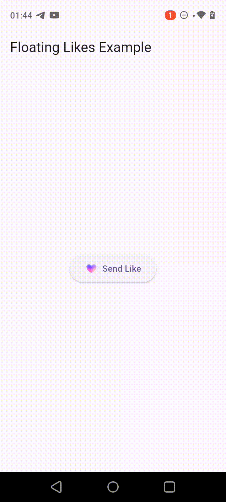

# 🎈 Floating Likes Flutter Package

A customizable widget for adding animated floating "likes" (e.g., hearts, emojis, etc.) in your Flutter app — perfect for live streams, chats, and interactive UIs.

## 📦 Installation

Add this to your `pubspec.yaml`:

```yaml
dependencies:
  floating_likes: ^0.0.1
```

Then run:

```bash
flutter pub get
```

## 🎬 Demo



## ✨ Features

- Trigger floating likes from a controller.
- Customize the icon, size, position, and animation.
- Lightweight and easy to integrate.

## 🚀 Usage

### 1. Import the Package

```dart
import 'package:floating_likes/floating_likes.dart';
```

### 2. Initialize the Controller

```dart
final FloatingLikesController _likesController = FloatingLikesController();
```

### 3. Add the Widget in Your UI

```dart
Stack(
  children: [
    // add it above your ui or widgets
    FloatingLikes(
      controller: _likesController,
      likeWidget: Image.asset('assets/heart.png'),
      likePosition: const EdgeInsets.only(bottom: 20, left: 20),
    ),
  ],
)
```

### 4. Trigger Likes

```dart
ElevatedButton(
  onPressed: () {
    _likesController.showLike();
  },
  child: Text("Send Like ❤️"),
)
```

## 🔧 Properties

`FloatingLikes` provides a customizable way to show floating like animations (e.g., hearts or emojis). Use the parameters below to control its appearance and behavior.

|       name        |          type           |   need   |                           description                           |
| :---------------: | :---------------------: | :------: | :-------------------------------------------------------------: |
|    controller     | FloatingLikesController | required |  Controller used to trigger the appearance of a floating like.  |
|    likeWidget     |         Widget          | required |  The widget to display as the floating like (e.g. heart icon).  |
|    widgetWidth    |         double          | optional |           Width of the like widget. Default is `50`.            |
|   widgetHeight    |         double          | optional |           Height of the like widget. Default is `50`.           |
|   likePosition    |       EdgeInsets        | optional |    Custom position for the like (left, top, right, bottom).     |
| animationDuration |        Duration         | optional |     Duration of scale/fade animation. Default is `1000ms`.      |
| translateDuration |        Duration         | optional |   Duration of floating animation upward. Default is `2400ms`.   |
|       curve       |          Curve          | optional | Curve used for the translate animation. Default is `easeInOut`. |

## 📂 Example

Check out `example/floating_likes_example/lib/main.dart` for a complete working demo.

## 📝 License

MIT License © 2025  
Maintained by Eyad Gomaa

## ❤️ Contributions

Feel free to open issues or submit pull requests. Happy coding!
